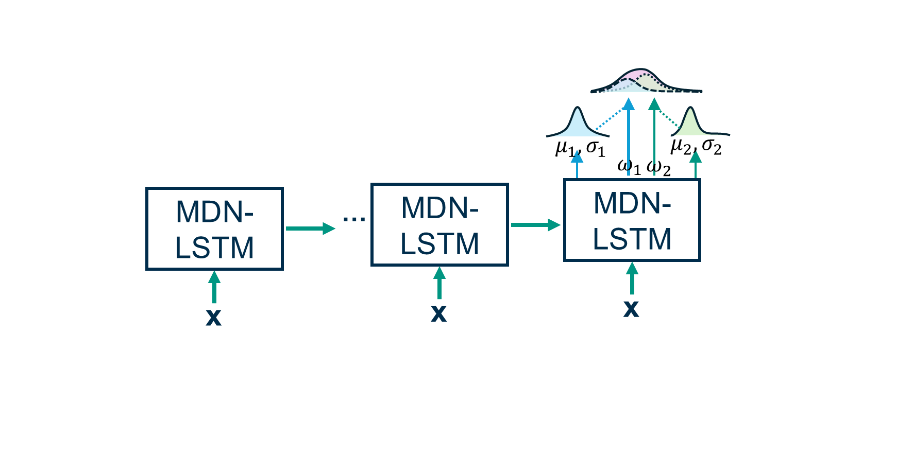

Modelzoo
========

The following section gives an overview of the implemented models and their possible variations. 

Model Classes
-------------

CudaLSTM
^^^^^^^^
:py:class:`hy2dl.modelzoo.cudalstm.CudaLSTM` uses the standard PyTorch LSTM implementation. By modifying the configurations, multiple model variations based on the CudaLSTM can be implemented.

Standard case
   The LSTM cell is used to analyze single-frequency data (e.g. daily data) in simulation mode. 

Multi-frequency
   By modifying configuration arguments, multiple temporal resolutions (e.g. hourly and daily) can be processed. Depending on the amount of inputs per frequency, different embeddings can be used to map the inputs to a common shared dimension. Details of the configuration arguments related to this model can be found in :ref:`mf_reference` and :ref:`emb_reference`.

   .. figure:: ../_static/mf_lstm.png
      :alt: Multi-frequency LSTM architecture
      :align: center

      Multi-frequency LSTM architecture

   Configuration files for multi-frequency approaches can be found in the examples folder in the GitHub repository. For further details of the architecture see: `Acuna Espinoza et al. (2025b) <https://doi.org/10.5194/hess-29-1749-2025>`_. 

Forecast LSTM
   By modifying configuration arguments, the LSTM cell rolls out continuously through both the hindcast and forecast periods, using specific embedding layers for each case. Details of the configuration arguments related to this model can be found in :ref:`fc_reference` and :ref:`emb_reference`.

   .. figure:: ../_static/fc_lstm.png
      :alt: Forecast LSTM architecture
      :align: center

      Forecast LSTM architecture

   Configuration files for the forecast configuration can be found in the examples folder in the GitHub repository.

Nan-handling LSTM
   By modifying configuration arguments, the LSTM cell can handle groups of missing data. The implemented nan-handling strategies are based on `Gauch et al. (2025) <https://doi.org/10.5194/hess-29-6221-2025>`_. Details of the configuration arguments related to this model can be found in :ref:`nan_reference`.

   .. figure:: ../_static/masked_mean.png
      :alt: Masked mean nan-handling strategy
      :align: center

      Masked mean nan-handling strategy.

   Configuration files for nan-handling methods can be found in the examples folder in the GitHub repository.

Further combinations...
   Combining different approaches is also possible. For example, one can define a configuration to implement a Forecast LSTM with multi-frequency approaches in the hindcast period, plus nan-handling capabilities.

LSTM-MDN: LSTM with Mixture Density Network output layer
^^^^^^^^^^^^^^^^^^^^^^^^^^^^^^^^^^^^^^^^^^^^^^^^^^^^^^^^
:py:class:`hy2dl.modelzoo.lstmmdn.LSTMMDN` combines an LSTM network with a Mixture Density Network (MDN) output layer. The MDN layer allows modeling the output as a mixture of probability distributions, enabling probabilistic predictions.

   Mixture Density Network LSTM architecture.

Further details can be found in: `Klotz et al. (2022) <https://doi.org/10.5194/hess-26-1673-2022>`_. An example using this model can be found in the notebooks folder in the GitHub repository.