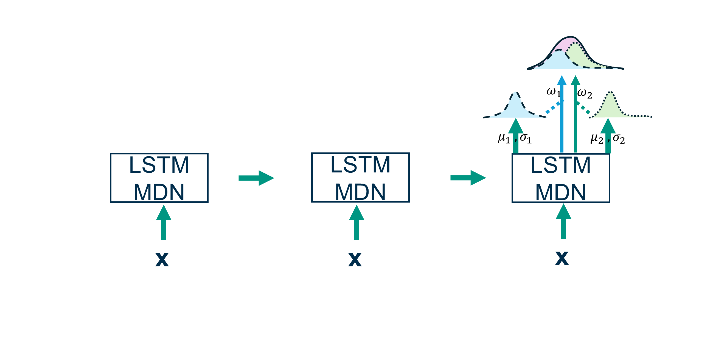

LSTM-MDN
========

:py:class:`hy2dl.modelzoo.lstmmdn.LSTMMDN` combines an LSTM network with a Mixture Density Network (MDN) output layer. The MDN layer allows modeling the output as a mixture of probability distributions, 
enabling probabilistic predictions.

Currently available distributions are: `gaussian` and `asymmetric_laplacian`. Further details can be found in `hy2dl.utils.distributions` and :ref:`mdn_reference`

   LSTM with mix density network output layer.

Further details can be found in: `Klotz et al. (2022) <https://doi.org/10.5194/hess-26-1673-2022>`_. An example using this model can be found in the notebooks folder in the GitHub repository.